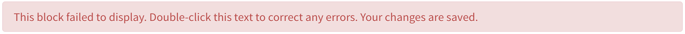

# Found bugs

General issues:

- Inline code rendering is funky: the box is too high, getting off the line
- Usual markdown syntax `` for inserting local pictures doesn't work (see below)
- Math formulas are not rendered properly $e^{i \pi} = -1$: sometimes they are, sometimes not. I'm not sure what's the pattern. Sometime changing `$...$` to `\(...\)` and `$$...$$` to `\[...\]` helps, sometimes not. (Plus I think the problem may be in the use of unicode symbols in formulas.

Related to the new (beta) editor:

- Leaving some section empty results in an error message: 
- Pushing to Github manually doesn't affect the document. But I can see the commit in the History tab on Authorea. If I open The post in incognito-mode, I see the latest version, but the logged-in editor shows me the old one. Switching to the old editor helps. I guess the new editor is not ready for wide use (at least in Chrome) yet.
- Clicking outside of the editing area doesn't turn off the editor mode
